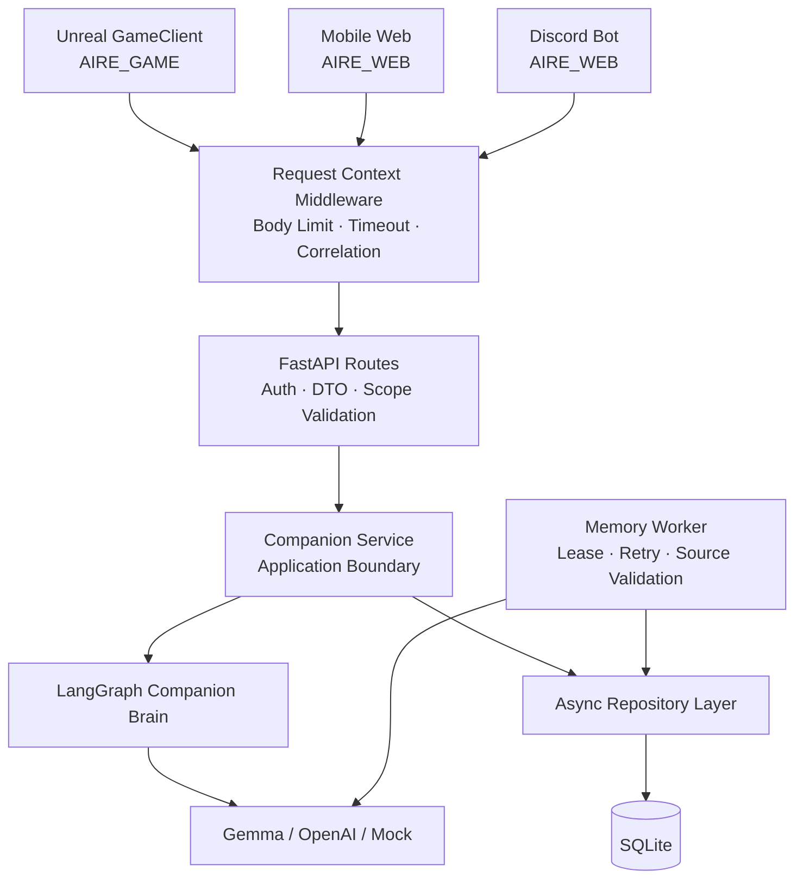
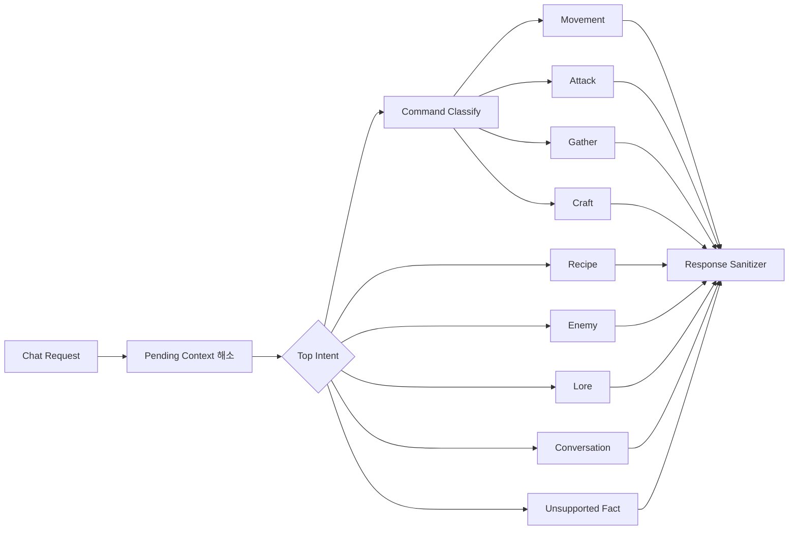

<div align="center">

# AIRE Server

**MAKO의 대화·의도 해석·장기기억·오프라인 작업과 게임 상태를 연결하는 FastAPI Backend**


[전체 프로젝트](https://github.com/AIREProject/AI_RE) · [Swagger UI](https://traip.mtvs2026.work/docs) · [Discord Bot](https://github.com/AIREProject/AIRE_Discord)

</div>

## 프로젝트 소개

AIRE Server는 Unreal, Mobile Web, Discord가 같은 MAKO의 대화·기억·작업 상태를 공유하도록 만드는 Backend입니다. FastAPI 계약 경계 안에서 인증·Scope·Schema·멱등성을 검증하고, LangGraph와 Gemma가 생성한 결과를 다시 정제한 뒤 각 Client에 전달합니다.

LLM은 게임 상태를 직접 수정하지 않습니다. 대사와 구조화된 행동 후보만 생성하며, 실제 Gameplay 실행은 Unreal Command Gateway가 담당합니다.

| 항목 | 내용 |
| --- | --- |
| Runtime | Python 3.13, FastAPI, Uvicorn |
| AI | LangGraph, Gemma Local LLM, OpenAI-compatible Structured Output |
| Data | SQLAlchemy Async, SQLite, Alembic 17개 Migration |
| API | Chat, Event, Command Result, Memory, Offline Task, Game State, Admin |
| Client Scope | `AIRE_OPEN / demo-slot-1 / mako` |
| Provider | Mock, OpenAI, OpenAI-compatible Local LLM |

## 전체 구조



## 1. 계약 우선 Backend 경계

요청은 Pydantic V2의 Strict Model로 검증하고, 인증된 Device Role과 `profile + save_slot + companion` Scope를 Application Service에 전달합니다.

| 계층 | 책임 |
| --- | --- |
| Middleware | Request ID, Body 크기, Timeout, Access Log와 오류 상관관계 |
| Route | Bearer Role, Query·Body DTO, HTTP Status와 Response Model |
| Service | Chat·Memory·Task·State 사용 사례와 Transaction 순서 |
| Brain | 의도 분류, 검증된 사실 조회, 대사와 행동 후보 생성 |
| Repository | SQLAlchemy Async Session과 영속성 세부 구현 |

- 외부 입력의 임의 Key와 지원하지 않는 Schema Version을 거부합니다.
- `X-Request-ID`와 응답 Request ID를 연결해 Client가 다른 응답을 잘못 소비하지 않도록 합니다.
- LLM·DB·Network 오류는 안정 Error Code와 Envelope로 정규화합니다.
- `/health`는 Liveness, `/ready`는 DB Migration과 AI 상태를 포함한 Readiness로 분리합니다.

관련 코드: [main.py](app/main.py), [middleware.py](app/middleware.py), [service.py](app/service.py), [errors.py](app/errors.py)

## 2. LangGraph 기반 대화와 의도 처리

사용자 발화를 하나의 거대한 Prompt로 처리하지 않고 의도별 Node로 분리했습니다.



### Structured Output

- OpenAI Provider는 Responses API의 JSON Schema 출력을 사용합니다.
- Local Provider는 OpenAI-compatible Chat Completions와 `response_format=json_schema`를 사용합니다.
- 분류·대사·기억 추출 결과를 각기 다른 Pydantic Model로 검증합니다.
- Provider Timeout, 연결 실패, Invalid JSON, 빈 응답을 구분하고 해당 단계만 Mock으로 복구합니다.
- Recipe·Item·Enemy·Location 정보는 LLM 지식이 아니라 DB에서 읽은 검증된 사실을 사용합니다.

관련 코드: [graph.py](app/brain/graph.py), [llm.py](app/brain/llm.py), [dialogue.py](app/brain/dialogue.py), [command_intent.py](app/brain/command_intent.py)

## 3. 출처 기반 장기기억

LLM이 새 문장을 만들어 사실처럼 저장하지 않도록 **기억의 원문과 분류 책임을 분리**했습니다.

```text
Player Message 또는 검증된 Game Event
  -> Canonical Source 저장
  -> Source Outbox 생성
  -> Memory Worker가 Lease 획득
  -> LLM은 Type · Importance · 승인 여부만 분류
  -> Backend가 Source ID와 원문 재검증
  -> Canonical 원문을 Memory로 저장
  -> Keyword · Embedding · Importance · Recency 검색
  -> 선택된 기억만 Prompt에 전달
  -> 실제 참조한 Memory ID를 응답에서 재검증
```

| 기능 | 구현 내용 |
| --- | --- |
| Source | `Message + RealWorld`, `Message + GameWorld`, 검증된 Event |
| Retrieval | Keyword, Embedding, Importance, Pinned, Recency를 조합한 제한 검색 |
| Control | 목록·검색·정정·고정·개별 삭제·Scope Reset |
| Review | 후보 상세 조회, Approve·Reject, 다른 결정의 충돌 방지 |
| Relationship | `Low · Growing · High` 상태와 Evidence·Audit 기록 |
| Retention | 원문·Audit 보존 기간과 주기적 Sweep 분리 |

기억은 대사 표현과 관계 맥락에만 사용합니다. Command 권한, Recipe 사실, GAS 수치와 Gameplay 상태를 바꾸는 근거로 사용하지 않습니다.

관련 코드: [memory_worker.py](app/memory_worker.py), [memory_service.py](app/memory_service.py), [source_memory_store.py](app/source_memory_store.py), [relationship_service.py](app/relationship_service.py)

## 4. Offline Task와 Game State 멱등성

Mobile Client가 요청한 채집·제작은 서버 시간과 Database Transaction을 기준으로 진행합니다.

| 영역 | 처리 방식 |
| --- | --- |
| 상태 전이 | `Pending → InProgress → Completed → Claimed` |
| 진행량 | Client 시간이 아니라 서버 경과시간으로 계산 |
| 제작 예약 | Task 생성과 재료 차감을 같은 Transaction으로 처리 |
| 취소 | 진행 중 예약을 삭제할 때 Container별 재료를 원자적으로 환불 |
| Game State | `operation_id`, `state_version`, Body SHA-256으로 재전송과 충돌 구분 |
| Role 경계 | Web은 Task를 생성·조회하고, UE만 Start·Complete·Claim과 State 변경 수행 |

같은 Operation ID와 같은 Body의 재전송에는 최초 결과를 재생하고, 같은 ID에 다른 Body가 들어오면 충돌로 처리합니다. 오래된 State Version은 현재 Snapshot을 덮어쓰지 못합니다.

관련 코드: [offline_task_service.py](app/offline_task_service.py), [game_state_service.py](app/game_state_service.py), [offline_tasks.py](app/routes/offline_tasks.py), [game_state.py](app/routes/game_state.py)

## 5. Database와 Migration

SQLAlchemy Async Model과 Repository를 사용하며 Schema 변경과 Seed 데이터는 Alembic Migration으로 관리합니다.

```text
migrations/versions/
  0001  Profile · Device · Pairing
  0002  Item · Recipe · Enemy
  0003  Offline Task
  0005  Episodic Memory
  0009  Game State
  0010  Canonical Source
  0014  Relationship State
  0016  Craft Reservation
  0017  Memory Candidate Review
```

현재 Model은 사용자·Device, 게임 데이터, 기억·관계, Offline Task, Game State, Conversation·Message, Event·Command Result와 Source Outbox를 포함합니다. 서버 시작 전에 반드시 `alembic upgrade head`를 실행하며, Chat 요청이 테이블을 임의 생성하지 않습니다.

관련 코드: [models.py](app/db/models.py), [connection.py](app/db/connection.py), [migrations](migrations/versions)

## 주요 API

| Surface | Endpoint | 역할 |
| --- | --- | --- |
| System | `GET /health`, `GET /ready` | Liveness와 배포 Readiness |
| Chat | `POST /api/v1/chat`, `WS /api/v1/chat` | 대화, Context, Command Candidate |
| Event | `POST /api/v1/events`, `POST /api/v1/command-results` | 검증된 게임 사건과 명령 결과 |
| Memory | `/api/v1/memories/*` | 목록·검색·정정·고정·삭제·초기화 |
| Review | `/api/v1/memory-candidates/*` | 기억 후보 조회와 승인·거절 |
| Task | `/api/v1/tasks/*` | 오프라인 작업 생성·진행·취소·정산 |
| Game State | `GET/PUT /api/v1/game-state` | Inventory Snapshot 동기화 |
| Admin | `/api/v1/admin/*` | 게임 데이터와 운영 정책 CRUD |

전체 계약과 Example은 실행 중인 서버의 `/docs`와 [API 문서](docs/api-endpoints.md)를 기준으로 합니다.

## 빠른 시작

필수 도구는 Python 3.13과 [uv](https://docs.astral.sh/uv/)입니다.

```powershell
git clone https://github.com/AIREProject/AIRE_SERVER.git
Set-Location AIRE_SERVER
uv sync --dev
New-Item -ItemType Directory -Force data
uv run alembic upgrade head
uv run uvicorn app.main:app --host 0.0.0.0 --port 8010
```

기본 설정은 외부 연결이 없는 Mock LLM과 SQLite를 사용하므로 `.env` 없이 시작할 수 있습니다.

- Health: `http://127.0.0.1:8010/health`
- Readiness: `http://127.0.0.1:8010/ready`
- Swagger UI: `http://127.0.0.1:8010/docs`
- OpenAPI JSON: `http://127.0.0.1:8010/openapi.json`

## LLM 설정

```powershell
Copy-Item .env.example .env
```

| Provider | 핵심 설정 | 용도 |
| --- | --- | --- |
| Mock | `LLM_PROVIDER=mock` | 외부 연결 없는 API·DB·Client 통합 기준 |
| OpenAI | `LLM_PROVIDER=openai`, `OPENAI_API_KEY`, `OPENAI_MODEL` | Responses API Structured Output |
| Local | `LLM_PROVIDER=local`, `LOCAL_LLM_BASE_URL`, `LOCAL_LLM_MODEL` | Gemma 등 OpenAI-compatible Runtime |

Embedding Provider는 대사 LLM과 별도로 Mock·OpenAI·Local을 선택할 수 있습니다. 정확한 Schema 지원 조건은 [LLM 설정](docs/llm-setup.md)을 확인하세요.

## 검증

```powershell
uv run pytest
uv run ruff check .
uv run mypy
```

Test Suite는 API, Service, Migration, Memory, Game State, Offline Task와 Provider 실패 경로를 포함합니다.

## 디렉터리 구조

```text
AIRE_SERVER/
├─ app/
│  ├─ brain/              # LangGraph, LLM, 대사·의도·기억
│  ├─ db/                 # SQLAlchemy Model과 Repository
│  ├─ routes/             # HTTP · WebSocket Endpoint
│  ├─ gamedata/           # Runtime 게임 데이터셋
│  ├─ service.py          # 외부 계약과 Brain 사이 경계
│  ├─ settings.py         # 환경변수와 운영 설정
│  └─ main.py             # FastAPI 조립과 Lifespan
├─ migrations/versions/   # Schema · Seed 변경 이력
├─ tests/                 # 회귀·실패 경로 Test Suite
├─ docs/                  # API, LLM, 배포·운영 문서
├─ .env.example
├─ pyproject.toml
└─ README.md
```

## 운영 문서

- [원격 서버 운영](REMOTE_SERVER_OPERATIONS.md)
- [인수인계·백업·복구](docs/handoff.md)
- [LLM과 Embedding 설정](docs/llm-setup.md)
- [API 사용법](docs/api-endpoints.md)
- [게임 데이터](docs/game-data.md)
- [Memory 배포 Runbook](docs/memory-deployment-runbook.md)

> 교육과정 종료에 따라 현재 공개 Backend와 Gemma 서버는 2026년 9월부터 운영이 종료될 예정입니다. 저장소는 Mock Provider를 기본값으로 제공하므로 외부 LLM 없이 API·DB·Client 연동 구조를 실행할 수 있습니다.
